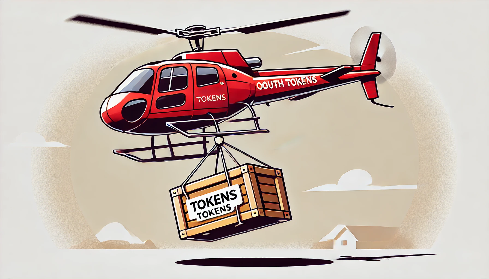
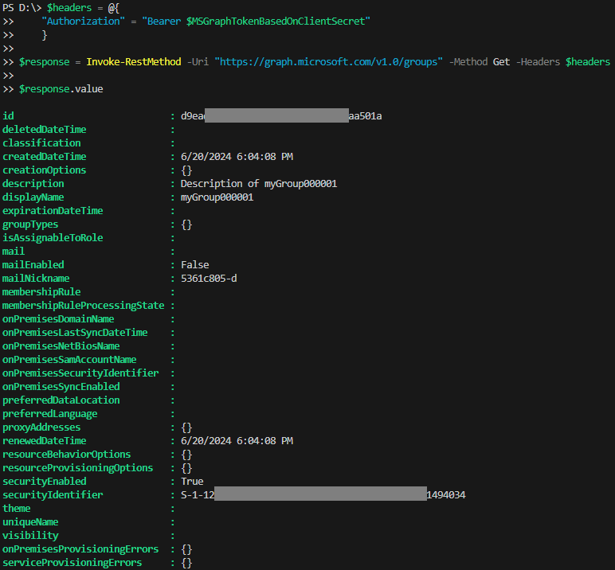

# 🚁 OAuth Tokencopter 3000 - Your Token Lifesaver!

Ever found yourself pulling your hair out trying to issue Microsoft Identity Tokens (login.microsoftonline.com)? Well, stress no more! OAuth Tokencopter 3000 is here to save your day (and your hair)!

## 🎯 What is it?

OAuth Tokencopter 3000 is a PowerShell-based lifesaver that makes REST API requests to the Microsoft Identity Provider and delivers tokens for a variety of occasions. Whether you have a refresh token or just credentials, OAuth Tokencopter 3000 has got you covered. You can also provide resources like `graph.microsoft.com`, `management.azure.com`, `api.partnercenter.microsoft.com` etc., and it will return tokens. It's like a token vending machine!

## 🚀 Getting Started

Before you start, make sure you have PowerShell version 7 installed on your machine. If you don't, you can download it from [here](https://aka.ms/powershell-release?tag=stable).

1. Clone this repository to your local machine.
2. Run the PowerShell script.
3. Follow the prompts to input your refresh token or credentials, and specify the resources you need.

## 🎁 Usage

Here's how to use OAuth Tokencopter 3000:

1. Run the PowerShell script.
2. Input your refresh token or credentials when prompted.
3. Specify the resources you need.
4. Sit back and watch as your tokens are delivered!

> [!TIP]
> 💡 **Pro Tip:** You can retrieve the details of `tokenPayload` from an EntraID App Registration. Check out the [quickstart guide](https://learn.microsoft.com/en-us/entra/identity-platform/quickstart-register-app) for more information.
Usage Preparation
```powershell
Import-Module .\New-MSToken.psm1 -Force

$tokenPayload = @{
    ClientId = "xxxxxxxx-xxxx-xxxx-xxxx-xxxxxxxxxxxx"
    ClientSecret = "yyyyyyyyyyyyyyyyyyyyyyyyyyyyyyyyyyyyyyyy"
    TenantId = "zzzzzzzz-zzzz-zzzz-zzzz-zzzzzzzzzzzz"
}
```

> [!TIP]
> 💡 **Pro Tip:** You can configure the permissions of your `tokenPayload` in an EntraID App Registration. Learn how to add permissions to your app registration in this [configuration guide](https://learn.microsoft.com/en-us/entra/identity-platform/quickstart-configure-app-access-web-apis).

Request Token Example #1
- `grant_type`: This is set to `client_credentials` when a refresh token is not provided.
- `Issuer URL Version`: This is set to `2`.
- `Resource`: This is set to `Microsoft Graph API`.
```powershell
$MSGraphTokenBasedOnClientSecret = New-MSToken `
    -ClientId $tokenPayload.ClientId `
    -ClientSecret $tokenPayload.ClientSecret `
    -TokenIssuerURL "https://login.microsoftonline.com/$($tokenPayload.TenantId)/oauth2/v2.0/token" `
    -Resource "https://graph.microsoft.com/.default" 
```


You may ask yourself "What can i do with that token?". Let's get some Entra Groups [Guide](https://learn.microsoft.com/en-us/graph/api/group-list?view=graph-rest-1.0&tabs=http#example-1-get-a-list-of-groups)
```powershell
$headers = @{
    "Authorization" = "Bearer $MSGraphTokenBasedOnClientSecret"
    }

$response = Invoke-RestMethod -Uri "https://graph.microsoft.com/v1.0/groups" -Method Get -Headers $headers

$response.value
```


> [!NOTE]
> Additional function call examples can be found in [examples.md](./examples/examples.md)

## 🙌 Contributing

OAuth Tokencopter 3000 is a community project. I encourage you to pitch in! If you've got a feature request, bug report, or if you'd like to contribute code, please feel free to do so.

## 📜 License

OAuth Tokencopter 3000 is licensed under the MIT License. See [LICENSE](LICENSE) for more information.

## 🎉 Final Words

No more token troubles! With OAuth Tokencopter 3000, issuing Microsoft Identity Tokens is as easy as pie. Enjoy your worry-free token issuing experience!